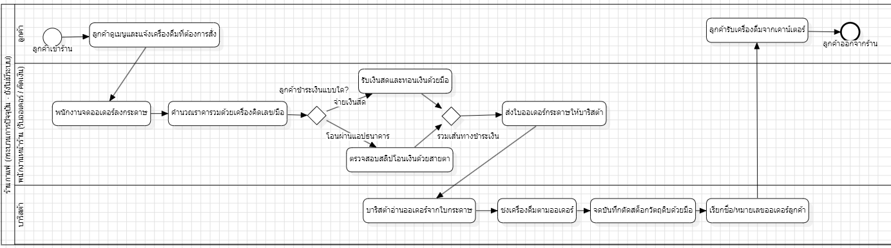
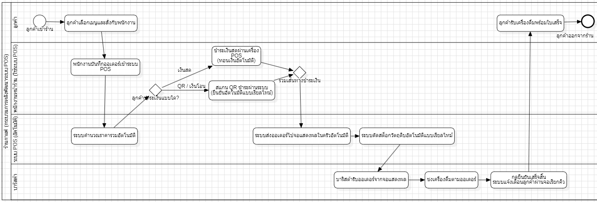

# WK02: รายงานความเป็นไปได้และแบบจำลองกระบวนการธุรกิจ

## ระบบ POS และจัดการสต็อกร้านกาแฟ 3–5 สาขา

---

## รายงานความเป็นไปได้อย่างย่อ

| หัวข้อ | เนื้อหา | ตัวอย่างเนื้อหา (ระบบร้านกาแฟ) |
|---|---|---|
| **ภาพรวมโครงการ** | ชื่อระบบ วัตถุประสงค์ ขอบเขตโดยสรุป ผู้มีส่วนได้ส่วนเสียหลัก | ระบบ POS และจัดการสต็อกร้านกาแฟ 3–5 สาขา เพื่อลดคิว ลดความผิดพลาดของออเดอร์ และเชื่อมโยงข้อมูลยอดขายกับสต็อกของทุกสาขาแบบเรียลไทม์ ผู้ใช้งานหลัก ได้แก่ เจ้าของร้าน ผู้จัดการสาขา พนักงานแคชเชียร์ บาริสต้า และลูกค้า |
| **Technical Feasibility** | เทคโนโลยีที่ใช้ ความพร้อมของทีม และความเสี่ยงด้านเทคนิค | ใช้ Node.js, Vue.js และ MySQL ทีมมีพื้นฐานเพียงพอและสามารถศึกษาการเชื่อมต่อเพิ่มเติมได้ ความเสี่ยงหลักคือการเชื่อมต่อเครื่องพิมพ์ใบเสร็จ อุปกรณ์ POS ระบบชำระเงิน และการซิงค์ข้อมูลข้ามสาขา |
| **Economic Feasibility** | ต้นทุนโดยประมาณ ผลประโยชน์ที่คาดว่าจะได้รับ และระยะเวลาคืนทุน | ต้นทุนประมาณ 25,000–30,000 บาทต่อสาขา ครอบคลุมอุปกรณ์ POS เครื่องพิมพ์ใบเสร็จ ระบบเครือข่าย และการอบรม คาดว่าจะคืนทุนภายใน 6–8 เดือน จากเวลาปิดยอดที่ลดลง ความผิดพลาดที่น้อยลง และการลดของเสียจากสต็อก |
| **Operational Feasibility** | ผลกระทบต่อผู้ใช้งาน ความพร้อมขององค์กร และแผนฝึกอบรม | พนักงานต้องปรับจากการจดออเดอร์ด้วยกระดาษมาใช้ระบบดิจิทัล โดยอบรมประมาณ 2–3 ชั่วโมงต่อสาขา ระบบควรออกแบบให้ใช้งานง่าย มีปุ่มขนาดใหญ่ และแสดงข้อมูลเท่าที่จำเป็น เจ้าของร้านสนับสนุนการเปลี่ยนแปลงเต็มที่ |
| **Schedule Feasibility** | แผนเวลาโดยสรุปพร้อม Milestone หลัก | สัปดาห์ 1–4 วิเคราะห์และออกแบบระบบ, สัปดาห์ 5–10 พัฒนาฟังก์ชันหลักของ POS, สัปดาห์ 11–14 พัฒนาสต็อกและรายงาน, สัปดาห์ 15–16 ทดสอบ แก้ไข และนำเสนอ |
| **ข้อสรุป** | ควรดำเนินโครงการต่อหรือไม่ พร้อมเหตุผลจากทั้ง 4 ด้าน | ควรดำเนินโครงการต่อ เนื่องจากเทคโนโลยีอยู่ในขอบเขตที่ทีมสามารถพัฒนาได้ มีโอกาสคืนทุนในระยะเวลาที่เหมาะสม สามารถนำไปใช้จริงได้หลังอบรม และมีกรอบเวลาพัฒนาเพียงพอ ความเสี่ยงหลักคือการเชื่อมต่อฮาร์ดแวร์และการปรับตัวของพนักงาน |

---

## BPMN Diagram แบบ As-Is

### คำอธิบาย

กระบวนการแบบ As-Is แสดงการทำงานของร้านกาแฟก่อนมีระบบ POS และระบบจัดการสต็อกแบบรวมศูนย์ พนักงานรับออเดอร์ด้วยการจดลงกระดาษ คำนวณราคาเอง ส่งออเดอร์ให้บาริสต้า และตรวจนับสต็อกภายหลัง

### แผนภาพ As-Is

### ญหาของกระบวนการ As-Is

1. พนักงานอาจจดเมนู ขนาด หรือรายละเอียดเพิ่มเติมผิด
2. กระดาษออเดอร์อาจสูญหายหรือถูกเรียงลำดับผิด
3. การคำนวณราคาและเงินทอนอาจผิดพลาด
4. ไม่สามารถตรวจสอบสต็อกของแต่ละสาขาแบบเรียลไทม์
5. ข้อมูลยอดขายและสต็อกของแต่ละสาขาไม่เชื่อมโยงกัน
6. การปิดยอดและตรวจนับสต็อกใช้เวลานาน
7. เจ้าของร้านไม่สามารถติดตามยอดขายได้ทันที

---

## BPMN Diagram แบบ To-Be

### คำอธิบาย

กระบวนการแบบ To-Be แสดงการทำงานหลังจากนำระบบ POS และระบบจัดการสต็อกมาใช้ ระบบจะตรวจสอบวัตถุดิบ คำนวณราคา บันทึกการชำระเงิน ส่งออเดอร์ให้บาริสต้า ตัดสต็อก และอัปเดตยอดขายโดยอัตโนมัติ

### แผนภาพ To-Be

---

## การเปรียบเทียบ As-Is และ To-Be

| ประเด็น | As-Is | To-Be |
|---|---|---|
| การรับออเดอร์ | จดลงกระดาษ | บันทึกผ่านระบบ POS |
| การตรวจสอบสต็อก | ตรวจด้วยสายตาหรือสอบถามบาริสต้า | ตรวจสอบจากฐานข้อมูลแบบเรียลไทม์ |
| การคำนวณราคา | พนักงานคำนวณเอง | ระบบคำนวณราคา ส่วนลด และยอดสุทธิ |
| การชำระเงิน | ตรวจเงินสดหรือสลิปด้วยตนเอง | ระบบคำนวณเงินทอนและตรวจสอบ QR Payment |
| การส่งออเดอร์ | ส่งกระดาษให้บาริสต้า | ส่งไปยังหน้าจอบาริสต้าโดยอัตโนมัติ |
| การจัดลำดับคิว | เรียงจากกระดาษ | ระบบสร้างหมายเลขออเดอร์และสถานะ |
| การตัดสต็อก | ตรวจนับหรือบันทึกภายหลัง | ตัดสต็อกตามสูตรเมนูอัตโนมัติ |
| ข้อมูลหลายสาขา | แยกกันแต่ละสาขา | เชื่อมเข้าสู่ฐานข้อมูลส่วนกลาง |
| รายงานยอดขาย | สรุปเมื่อสิ้นวัน | อัปเดตแบบเรียลไทม์ |
| ความผิดพลาด | เกิดได้ง่ายจากการทำงานด้วยมือ | ลดลงด้วยการตรวจสอบของระบบ |

---

## BPMN แบบ To-Be ช่วยแก้ปัญหาด้าน Operational Feasibility อย่างไร

BPMN แบบ To-Be ช่วยลดขั้นตอนการทำงานที่ต้องใช้กระดาษ ลดความผิดพลาดในการรับออเดอร์และคำนวณราคา รวมถึงส่งออเดอร์ไปยังบาริสต้าและตัดสต็อกโดยอัตโนมัติ ทำให้พนักงานทำงานได้รวดเร็วขึ้น ลดเวลารอของลูกค้า และบริหารหลายสาขาได้ง่ายขึ้น

## BPMN แบบ To-Be ช่วยแก้ปัญหาด้าน Economic Feasibility อย่างไร

BPMN แบบ To-Be ช่วยลดต้นทุนจากความผิดพลาดในการรับออเดอร์และการคิดเงิน ลดการสูญเสียวัตถุดิบด้วยการตัดสต็อกอัตโนมัติ ลดเวลาปิดยอดประจำวัน และเพิ่มความรวดเร็วในการให้บริการลูกค้า ส่งผลให้ร้านมีประสิทธิภาพมากขึ้นและสามารถคืนทุนจากการลงทุนในระบบได้เร็วขึ้น

---

## สรุป

จากการศึกษาความเป็นไปได้ทั้ง 4 ด้าน โครงการระบบ POS และจัดการสต็อกสำหรับร้านกาแฟ 3–5 สาขามีความเหมาะสมที่จะดำเนินการต่อ เทคโนโลยีอยู่ในขอบเขตที่ทีมสามารถพัฒนาได้ ต้นทุนมีโอกาสคืนทุนภายใน 6–8 เดือน พนักงานสามารถปรับตัวได้หลังการอบรม และสามารถพัฒนาโครงการภายในระยะเวลา 16 สัปดาห์

BPMN แบบ To-Be แสดงให้เห็นว่าระบบใหม่ช่วยลดขั้นตอนการทำงานด้วยมือ ลดความผิดพลาด เชื่อมโยงข้อมูลทุกสาขา และเพิ่มความสามารถในการติดตามยอดขายกับสต็อกแบบเรียลไทม์ จึงช่วยแก้ปัญหาทั้งด้าน Operational Feasibility และ Economic Feasibility ได้อย่างชัดเจน

---