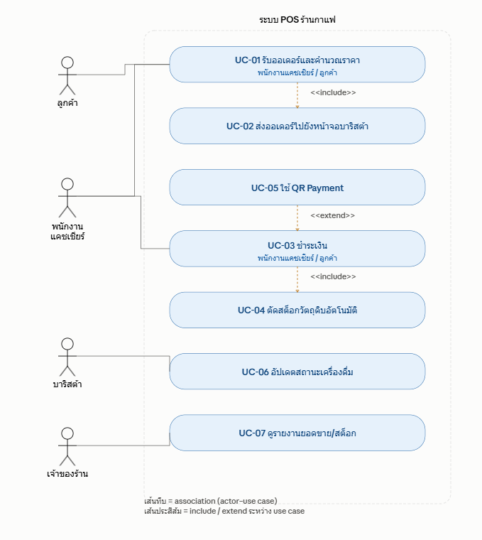

# WK04: User Stories และ Use Case Diagram
## ระบบ POS และจัดการสต็อกร้านกาแฟ 3–5 สาขา
## 1. Actor ที่เกี่ยวข้องกับระบบ

| Actor | บทบาท / เหตุผลที่เกี่ยวข้อง | อ้างอิงจาก wk03 |
|---|---|---|
| **ลูกค้า** | ผู้สั่งเครื่องดื่ม/อาหาร และเป็นผู้ชำระเงิน (เลือกวิธีชำระเงินได้เอง) | ผู้มีส่วนได้ส่วนเสีย, FR-03, FR-04 |
| **พนักงานแคชเชียร์** | ผู้ป้อนออเดอร์เข้าระบบ POS และรับชำระเงินหน้าร้าน | ผู้มีส่วนได้ส่วนเสีย, FR-01, FR-02, FR-03 |
| **บาริสต้า** | ผู้รับออเดอร์ที่หน้าจอครัว/บาร์ และอัปเดตสถานะเครื่องดื่ม | ผู้มีส่วนได้ส่วนเสีย, FR-05 |
| **เจ้าของร้าน** | ผู้ดูภาพรวมยอดขายและสต็อกของทุกสาขาเพื่อตัดสินใจทางธุรกิจ | ผู้มีส่วนได้ส่วนเสีย, FR-08, FR-09, FR-10 |

รวม 4 actor (มากกว่าเกณฑ์ขั้นต่ำ 3 actor) — เลือกเฉพาะ actor ที่มี use case ชัดเจนตาม Functional Requirements ของสัปดาห์ที่ 3 ส่วน "ผู้จัดการสาขา" ที่ระบุใน stakeholder ของ wk03 ยังไม่ถูกแยกเป็น use case เฉพาะในสัปดาห์นี้ (สิทธิ์ใกล้เคียงเจ้าของร้านแต่จำกัดเฉพาะสาขา) จึงยังไม่ใส่เป็น actor แยก เพื่อไม่ให้ diagram ซับซ้อนเกินจำเป็นในสัปดาห์นี้

---

## 2. Use Case Diagram

### 2.1 รายการ Use Case (7 use cases)

| รหัส | ชื่อ Use Case | Actor หลัก |
|---|---|---|
| UC-01 | รับออเดอร์และคำนวณราคา | พนักงานแคชเชียร์ (ลูกค้าเป็น actor รอง) |
| UC-02 | ส่งออเดอร์ไปยังหน้าจอบาริสต้า | *(ไม่มี actor ตรง — ถูกเรียกผ่าน include เท่านั้น)* |
| UC-03 | ชำระเงิน | พนักงานแคชเชียร์, ลูกค้า |
| UC-04 | ตัดสต็อกวัตถุดิบอัตโนมัติ | *(ไม่มี actor ตรง — ถูกเรียกผ่าน include เท่านั้น)* |
| UC-05 | ชำระเงินด้วย QR Payment | *(ไม่มี actor ตรง — เข้าถึงได้ผ่าน UC-03 เท่านั้น)* |
| UC-06 | อัปเดตสถานะเครื่องดื่ม | บาริสต้า |
| UC-07 | ดูรายงานยอดขายและตรวจสอบสต็อก | เจ้าของร้าน |

### 2.2 ความสัมพันธ์ระหว่าง Use Case

- **Include:** UC-01 "รับออเดอร์และคำนวณราคา" (base) → UC-02 "ส่งออเดอร์ไปยังหน้าจอบาริสต้า" (included) — ทุกครั้งที่ยืนยันออเดอร์สำเร็จ ต้องส่งไปบาริสต้าเสมอ (mandatory) ลูกศรชี้จาก UC-01 ออกไปยัง UC-02
- **Include:** UC-03 "ชำระเงิน" (base) → UC-04 "ตัดสต็อกวัตถุดิบอัตโนมัติ" (included) — สมมติฐานทางธุรกิจของกลุ่ม (ตามที่ wk04 หัวข้อ 2.5 ระบุว่ายังไม่มีการกำหนดไว้ชัดเจนในโจทย์): **ตัดสต็อกทันทีที่ชำระเงินสำเร็จ** เพื่อไม่ให้ตัดสต็อกซ้ำหากออเดอร์ถูกยกเลิกก่อนจ่ายเงิน ลูกศรชี้จาก UC-03 ออกไปยัง UC-04
- **Extend:** UC-05 "ชำระเงินด้วย QR Payment" (extending) → UC-03 "ชำระเงิน" (base) — เกิดขึ้นเฉพาะเมื่อลูกค้าเลือกวิธีชำระด้วย QR เท่านั้น (optional) ลูกศรชี้จาก UC-05 กลับเข้าหา UC-03 (สวนทางกับ include) — และ "ลูกค้า" ไม่ควรมีเส้น Association ตรงไปยัง UC-05 เพราะเข้าถึงได้ผ่าน UC-03 เท่านั้น 

### 2.3 แผนภาพ 


---

## 3. Use Case Description: UC-01 "รับออเดอร์และคำนวณราคา"

```
Use Case: รับออเดอร์และคำนวณราคา
Actor: พนักงานแคชเชียร์ (primary), ลูกค้า (secondary)
Precondition:
  - พนักงานแคชเชียร์ login เข้าสู่ระบบ POS แล้ว
  - เมนูสินค้าและราคาถูกตั้งค่าไว้ในระบบแล้ว

Main Flow:
1. ลูกค้าแจ้งรายการเครื่องดื่ม/อาหารที่ต้องการกับพนักงานแคชเชียร์
2. พนักงานแคชเชียร์เลือกรายการสินค้าในหน้าจอ POS
3. ระบบคำนวณราคารวมของแต่ละรายการอัตโนมัติ
4. พนักงานแคชเชียร์ยืนยันออเดอร์
5. ระบบบันทึกออเดอร์และสร้างหมายเลขคิว
6. ระบบ include Use Case "ส่งออเดอร์ไปยังหน้าจอบาริสต้า"

Alternative Flow:
3a. ลูกค้าขอเพิ่ม/ลดจำนวนสินค้าก่อนยืนยัน → ระบบคำนวณราคารวมใหม่ทุกครั้งที่จำนวนเปลี่ยน แล้วกลับเข้าขั้นตอนที่ 4
4a. ลูกค้ามีรหัสส่วนลด → พนักงานแคชเชียร์กรอกรหัสส่วนลด ระบบคำนวณยอดสุทธิหลังหักส่วนลด ก่อนไปขั้นตอนที่ 5

Exception Flow:
2a. สินค้าที่ลูกค้าต้องการหมดสต็อกวัตถุดิบ → ระบบแจ้งเตือนพนักงานแคชเชียร์ว่าสินค้าไม่พร้อมจำหน่าย และไม่อนุญาตให้เพิ่มรายการนั้นในออเดอร์
5a. ระบบขัดข้องระหว่างสร้างหมายเลขคิว → ระบบแสดงข้อความแจ้งข้อผิดพลาด และไม่บันทึกออเดอร์นั้น

Postcondition:
  - สำเร็จ: ออเดอร์ถูกบันทึกพร้อมหมายเลขคิว สถานะ "รอชำระเงิน"
  - ไม่สำเร็จ: ออเดอร์ไม่ถูกบันทึก ระบบยังอยู่ที่หน้าจอเลือกสินค้าเดิม
```

---

## 4. User Stories และ Acceptance Criteria

### ตารางแปลง Functional Requirement → User Story

| FR (จาก wk03) | User Story |
|---|---|
| FR-01, FR-02 | US-01 |
| FR-02 | US-02 |
| FR-06 | US-03 |
| FR-03, FR-06 | US-04 |
| FR-03, FR-04 | US-05 |
| FR-05, FR-07 | US-06 |
| FR-08, FR-09, FR-10 | US-07 |

---

**US-01** (จาก Main Flow ของ UC-01)
> As a พนักงานแคชเชียร์, I want บันทึกรายการสั่งซื้อและให้ระบบคำนวณราคารวมอัตโนมัติ, So that รับออเดอร์ได้รวดเร็วและลดความผิดพลาดจากการคิดเงินด้วยมือ

- Given ลูกค้าสั่งเครื่องดื่ม 2 รายการ, When พนักงานแคชเชียร์เลือกสินค้าทั้ง 2 รายการในหน้าจอ POS, Then ระบบต้องแสดงราคารวมของทั้ง 2 รายการถูกต้องทันที
- Given พนักงานแคชเชียร์ยืนยันออเดอร์แล้ว, When ระบบบันทึกออเดอร์สำเร็จ, Then ระบบต้องสร้างหมายเลขคิวและแสดงให้พนักงานเห็นทันที
- Given ระบบขัดข้องระหว่างสร้างหมายเลขคิว, When พนักงานแคชเชียร์กดยืนยันออเดอร์, Then ระบบต้องแสดงข้อความแจ้งข้อผิดพลาดและไม่บันทึกออเดอร์นั้น *(ครอบคลุม Exception Flow 5a)*

---

**US-02** (จาก Alternative Flow 4a ของ UC-01)
> As a พนักงานแคชเชียร์, I want กรอกรหัสส่วนลดให้ลูกค้าตอนสร้างออเดอร์, So that ลูกค้าได้รับส่วนลดที่ถูกต้องก่อนไปชำระเงิน

- Given ออเดอร์มียอดรวม 200 บาท และลูกค้ามีรหัสส่วนลด 10%, When พนักงานแคชเชียร์กรอกรหัสส่วนลดที่ถูกต้อง, Then ระบบต้องคำนวณยอดสุทธิเป็น 180 บาททันที
- Given พนักงานแคชเชียร์กรอกรหัสส่วนลดที่ไม่ถูกต้องหรือหมดอายุ, When ระบบตรวจสอบรหัส, Then ระบบต้องแจ้งเตือนว่ารหัสไม่ถูกต้องและไม่ลดยอดเงิน

---

**US-03** (จาก Exception Flow 2a ของ UC-01)
> As a พนักงานแคชเชียร์, I want เห็นการแจ้งเตือนทันทีเมื่อสินค้าที่ลูกค้าต้องการหมดสต็อก, So that แจ้งลูกค้าเปลี่ยนรายการได้โดยไม่ต้องยกเลิกออเดอร์ทั้งหมดภายหลัง

- Given เมนู "ลาเต้เย็น" มีสต็อกนมไม่เพียงพอ, When พนักงานแคชเชียร์พยายามเพิ่ม "ลาเต้เย็น" ลงในออเดอร์, Then ระบบต้องแสดงข้อความแจ้งว่าสินค้าไม่พร้อมจำหน่ายและไม่เพิ่มรายการนั้น
- Given ระบบแจ้งว่าสินค้าหมดสต็อก, When พนักงานแคชเชียร์เลือกเมนูอื่นแทน, Then ระบบต้องอนุญาตให้เพิ่มเมนูใหม่ในออเดอร์ได้ตามปกติ

---

**US-04** (จาก UC-03 ชำระเงิน ที่ include UC-04 ตัดสต็อก)
> As a พนักงานแคชเชียร์, I want ให้ระบบตัดสต็อกวัตถุดิบอัตโนมัติทันทีที่ชำระเงินสำเร็จ, So that ข้อมูลสต็อกตรงกับความเป็นจริงโดยไม่ต้องนับสต็อกด้วยมือ

- Given ออเดอร์เครื่องดื่ม 1 แก้วใช้กาแฟ 18 กรัม, When ลูกค้าชำระเงินสำเร็จ, Then ระบบต้องตัดสต็อกกาแฟ 18 กรัมออกจากคลังทันที
- Given การชำระเงินไม่สำเร็จ, When ระบบตรวจพบว่าไม่มีการตัดยอดเงิน, Then ระบบต้องไม่ตัดสต็อกวัตถุดิบของออเดอร์นั้น

---

**US-05** (จาก UC-05 ใช้ QR Payment ที่ extend UC-03)
> As a ลูกค้า, I want ชำระเงินด้วย QR Payment ตอนจ่ายเงินที่เคาน์เตอร์, So that ไม่ต้องพกเงินสดและจ่ายเงินได้สะดวก

- Given ลูกค้าเลือกชำระเงินด้วย QR Payment, When ลูกค้าสแกนจ่ายผ่านแอปธนาคารสำเร็จ, Then ระบบต้องตรวจสอบสถานะการชำระเงินและเปลี่ยนสถานะออเดอร์เป็น "ชำระเงินแล้ว" ภายใน 2 วินาที
- Given ลูกค้าสแกน QR แล้วแต่ยังไม่โอนเงินภายในเวลาที่กำหนด, When ระบบตรวจสอบสถานะไม่พบการชำระเงิน, Then ระบบต้องแสดงสถานะ "รอการชำระเงิน" และไม่เปลี่ยนเป็นชำระเงินแล้ว

---

**US-06** (จาก UC-06 อัปเดตสถานะเครื่องดื่ม)
> As a บาริสต้า, I want อัปเดตสถานะการทำเครื่องดื่มแต่ละออเดอร์บนหน้าจอ, So that พนักงานแคชเชียร์และลูกค้ารู้ว่าเครื่องดื่มถึงคิวไหนแล้ว

- Given ออเดอร์หมายเลข 015 อยู่ในคิวรอทำ, When บาริสต้ากดปุ่ม "เริ่มทำ", Then สถานะของออเดอร์ต้องเปลี่ยนเป็น "กำลังทำ" ทันที
- Given ออเดอร์กำลังทำอยู่, When บาริสต้ากดปุ่ม "เสร็จแล้ว", Then สถานะต้องเปลี่ยนเป็น "พร้อมเสิร์ฟ" และหมายเลขคิวต้องแสดงบนจอเรียกคิว

---

**US-07** (จาก UC-07 ดูรายงานยอดขายและตรวจสอบสต็อก)
> As a เจ้าของร้าน, I want ดูยอดขายและสต็อกคงเหลือของทุกสาขาแบบเรียลไทม์ผ่านหน้าจอเดียว, So that ตัดสินใจสั่งวัตถุดิบเพิ่มหรือปรับกลยุทธ์การขายได้ทันเวลา

- Given สาขา A และสาขา B มีการขายเกิดขึ้นวันนี้, When เจ้าของร้านเปิดหน้ารายงานยอดขายรวม, Then ระบบต้องแสดงยอดขายของทั้ง 2 สาขาแยกกันและยอดรวมถูกต้อง
- Given สต็อกกาแฟของสาขา A เหลือต่ำกว่าเกณฑ์ที่กำหนด, When เจ้าของร้านเปิดหน้าตรวจสอบสต็อก, Then ระบบต้องแสดงสถานะสต็อกของสาขา A เป็น "ใกล้หมด" พร้อมสัญลักษณ์แจ้งเตือน

---

## 5. ตรวจสอบ INVEST

| US | Independent | Negotiable | Valuable | Estimable | Small | Testable |
|---|---|---|---|---|---|---|
| US-01 | แยกพัฒนาได้ เป็นแกนหลักของ POS ไม่ต้องรอฟีเจอร์อื่น | รายละเอียด UI การเลือกสินค้าปรับได้ | ลดข้อผิดพลาดการคิดเงินด้วยมือ | scope ชัดเจน (CRUD ออเดอร์ + คำนวณราคา) | จำกัดเฉพาะสร้างออเดอร์ ไม่รวมชำระเงิน | มี AC แบบ Given-When-Then ครบ 3 ข้อ |
| US-02 | แยกจาก flow หลักได้ เป็น optional step | เงื่อนไขส่วนลด (%/บาท) ปรับได้ภายหลัง | ลูกค้าได้ประโยชน์ตรงจากส่วนลด | ประเมินได้ เพราะเป็นการตรวจรหัสกับฐานข้อมูล | จำกัดเฉพาะการกรอก/ตรวจรหัส 1 รหัส | ตรวจสอบได้ด้วยตัวเลขยอดก่อน-หลังหักส่วนลด |
| US-03 | แยกพัฒนาได้ เป็นการตรวจสอบสต็อกก่อนเพิ่มสินค้า | เกณฑ์ "หมดสต็อก" (0 หรือใกล้ 0) ปรับได้ | ป้องกันลูกค้าสั่งของที่ทำไม่ได้จริง | scope ชัดเจน คือเช็คจำนวนคงเหลือ | จำกัดเฉพาะ exception เดียว ไม่รวม auto-reorder | มีเงื่อนไข Given-When-Then ตรวจได้ทันที |
| US-04 | แยกพัฒนาได้ เพราะ trigger จากเหตุการณ์ชำระเงินสำเร็จ | สูตรตัดสต็อกต่อเมนูปรับได้ภายหลัง | ทำให้สต็อกตรงความจริงแบบอัตโนมัติ | ประเมินได้ เพราะสูตรเมนูมีอยู่แล้ว | จำกัดเฉพาะการตัดสต็อกตามสูตร ไม่รวมแจ้งเตือนสั่งซื้อ | ตรวจสอบได้จากจำนวนสต็อกก่อน-หลัง |
| US-05 | แยกพัฒนาได้จาก flow ชำระเงินหลัก (extend) | ผู้ให้บริการ QR Payment เลือก/เปลี่ยนได้ | ลูกค้าสะดวกไม่ต้องพกเงินสด | ประเมินได้ เพราะใช้ API ตรวจสอบสถานะที่มาตรฐาน | จำกัดเฉพาะ flow QR ไม่รวมวิธีชำระเงินอื่น | มี AC ครอบคลุมทั้งกรณีสำเร็จและรอชำระ |
| US-06 | แยกพัฒนาได้ เป็นการอัปเดตสถานะที่มีอยู่แล้วในระบบ | จำนวนสถานะ (เริ่มทำ/เสร็จแล้ว) ปรับได้ตามทีม | ลดความสับสนเรื่องคิวสำหรับลูกค้าและพนักงาน | ประเมินได้ เพราะเป็นการเปลี่ยน state ง่าย | จำกัดเฉพาะการอัปเดตสถานะ ไม่รวมคำนวณเวลาโดยประมาณ | ตรวจสอบสถานะก่อน-หลังกดปุ่มได้ตรงไปตรงมา |
| US-07 | แยกพัฒนาได้ เพราะอ่านข้อมูลสรุปที่มีอยู่แล้ว | รูปแบบแสดงผล (ตาราง/กราฟ) ปรับได้ | ช่วยเจ้าของร้านตัดสินใจทางธุรกิจ | ประเมินได้ เพราะเป็น query รวมยอดจากข้อมูลที่มีโครงสร้างชัดเจน | จำกัดเฉพาะรายงานยอดขาย/สต็อก ไม่รวม export ไฟล์ | มี AC ตรวจได้จากยอดขายและสถานะสต็อกที่แสดง |

---
